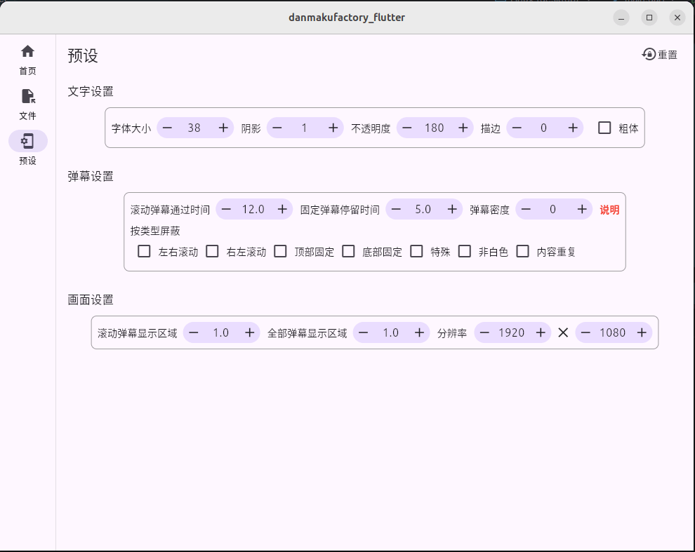
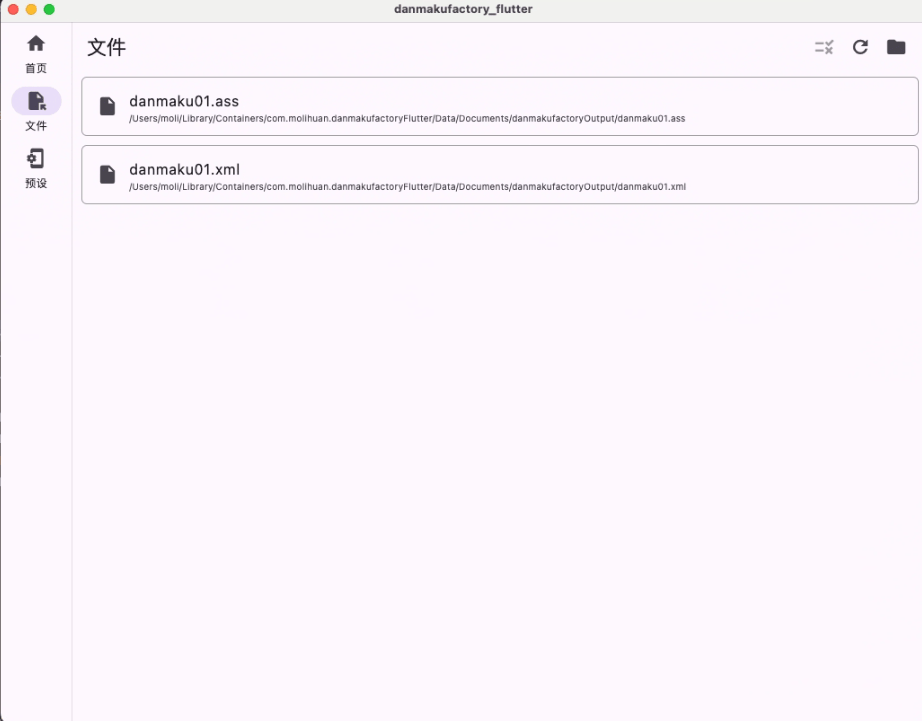

# danmakufactory_flutter

[DanmakuFactory](https://github.com/hihkm/DanmakuFactory) 弹幕文件转换工具,flutter ui

## 特性

- [x] 支持Windows
- [x] 支持Android

- [x] 支持Harmony

- [x] 支持Linux

- [x] 支持Mac

- [ ] 支持ios

- [x] 支持UI操作

- [x] 支持命令行操作

## 预览

| 平台    | 页面                                                              |
| ------- |-----------------------------------------------------------------|
| Windows |  |
| Android |  |
| Harmony |  |
| Linux   |      |
| Mac     |          |
| ios     | 待补充                                                             |


## 源码编译事项
Android Studio版本:2025.3.3

JDK版本:17

flutter版本:3.35.7

xmake版本:3.0.8

克隆项目
进入[danmakufactory/src/CMakeLists.txt](danmakufactory/src/CMakeLists.txt),将OHOS_NATIVE_SDK改为你自己本地的路径
直接编译即可享用

常用命令:
```sh
# 命令行模式
danmakufactory_flutter.exe -cmd -i inputFilePath -o outputFilePath
# 命令行模式(查看运行详情,仅仅Windows)
danmakufactory_flutter.exe -cmd -i inputFilePath -o outputFilePath | more

# 代码生成
dart run build_runner watch -d

# windows打包
flutter build windows --release

# macOS打包
flutter build macos --release

# 虚拟机ui倒置问题运行
LIBGL_ALWAYS_SOFTWARE=1 flutter run -d linux

# Linux打包
flutter build linux --release

# Android release 包
flutter build apk --release

# Android分割 ABI 构建，减小 apk 大小
flutter build apk --release --split-per-abi

# 进行dart代码混淆
flutter build apk --release --split-per-abi --obfuscate --split-debug-info=build/debug-info --tree-shake-icons

# 鸿蒙打包
flutter build hap --release

flutter build app --release

```

## 特别鸣谢

- https://github.com/hihkm/DanmakuFactory
- https://github.com/PCRE2Project/pcre2

教程或开源项目以及其依赖项目。

## LICENSE

```
只需遵循上游的开源协议即可(上游包括:https://github.com/hihkm/DanmakuFactory 和 https://github.com/PCRE2Project/pcre2)
请尽情享受开源
```
